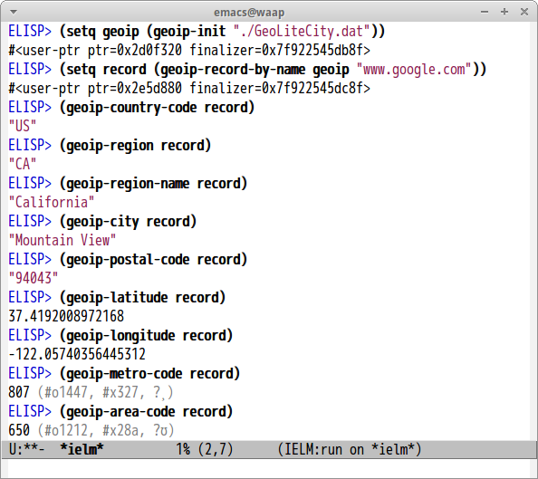

# geoip.el

[libGeoIP](https://github.com/maxmind/geoip-api-c) binding of Emacs Lisp. This package is inspired by [mruby-geoip](https://github.com/matsumoto-r/mruby-geoip) and [geoip-api-python](https://github.com/maxmind/geoip-api-python).

## Screenshot

## Interfaces

#### `(geoip-init db)`

Initialize geoip instance from `db` and return `geoip` instance. `db` is database file. You can download it from [here](http://dev.maxmind.com/geoip/legacy/geolite/).

#### `(geoip-record-by-name geoip host)`

Get GetIP record from `host` and return GeoIPRecord instance.

#### `(geoip-record-by-addr geoip addr)`

Get GetIP record from `addr` and return GeoIPRecord instance.

#### `(geoip-country-code record)`

Return country code from record object.

#### `(geoip-region record)`

Return region from record object.

#### `(geoip-region-name record)`

Return region-name from record object.

#### `(geoip-city record)`

Return city from record object.

#### `(geoip-postal-code record)`

Return postal code from record object.

#### `(geoip-latitude record)`

Return latitude from record object.

#### `(geoip-longitude record)`

Return longitude from record object.

#### `(geoip-metro-code record)`

Return metro code from record object.

#### `(geoip-area code record)`

Return area code from record object.

#### `(geoip-time-zone record)`

Return from record object.
